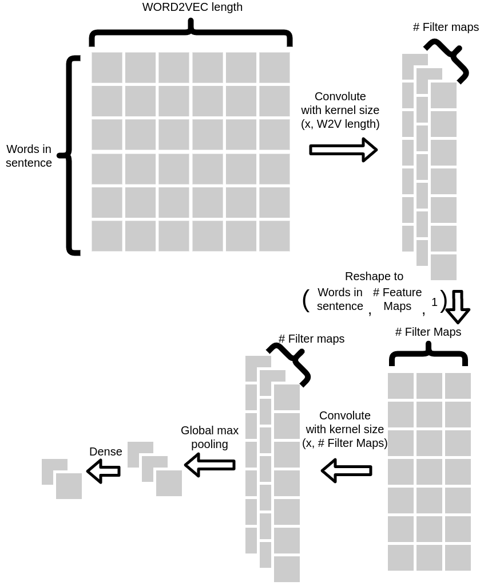

# CNN Sentence Classification
This repository implements a Convolutional Neural Network for Sentence Classification, based on the work of Yoon Kim ([original paper](https://arxiv.org/pdf/1408.5882.pdf)). 

## Datasets Used

### Movie Review
The [Movie Review dataset](https://www.cs.cornell.edu/people/pabo/movie-review-data/) contains 5331 labelled positive and 5331 labelled negative reviews from IMDb.
Download the **sentence polarity dataset v1.0** file and extract it. Place it under the `data/` folder, as shown in the file directory structure below.

### Subjectivity
The [Subjectivity dataset](https://www.cs.cornell.edu/people/pabo/movie-review-data/) contains 5000 labelled subjective and 5000 labelled objective snippets from movie reviews from Rotten Tomatoes and IMDb.
Download the **Subjectivity dataset v1.0** file and extract it. Place it under the `data/` folder, as shown in the file directory structure below.


## Hyper-parameter Search
To improve on the baseline accuracy, an extensive incremental hyper-parameter search is done to try and find the hyper-parameter values that result in a higher accuracy. 
The hyper-parameter values are explored and set one by one.

## Architectural Changes
To address the loss of temporal information in Kim's original model, the architecture of the CNN was modified by reshaping and performing a 2D convolution before pooling and feeding the results to a dense layer.

<p align="center"></p>

## Packages Needed

- gensim
- nltk

## Word Embeddings

This project makes use of Google's word2vec embeddings, which constructs vector representations of words through their implementation of continuous bag-of-words and skip-gram.
Download the [GoogleNews-vectors-negative300.bin](https://s3.amazonaws.com/dl4j-distribution/GoogleNews-vectors-negative300.bin.gz) file, and place it under the `data/` folder.


## How to Run the Program
1. Download the Movie Reviews dataset and the Subjectivity dataset as indicated above, and place them in the `data/` folder. Ensure they follow the same directory structure as below.
2. Make sure GoogleNews-vectors-negative300.bin is located under the `data/` folder.
3. Open the `src/config.py` file and do the following:
    * While they shouldn't require modification, double check that all filepaths are ok.
    * Set the configuration to run, such as the dataset (MR for Movie Review, SUBJ for Subjectivity), vector type to use (random, word2vec) and embedding option (static, dynamic).
    * Set the number of epochs and folds desired.
    * Set the desired model hyper-parameter values (feature maps, kernel size, regularization strength, dropout rate and optimizer)
    * If you wish to run incremental parameter tuning, set `RUN_INCREMENTAL_BEST_PARAMS` to `True`. Assign arrays of the values to explore to the hyper-parameter variables ending in `_INCREMENTAL`.
4. Run the `main.py` script.

## Directory Structure
```
.
+-- data
�   +-- GoogleNews-vectors-negative300.bin
�   �
�   +-- rt-polaritydata
�   �   +-- rt-polarity.neg
�   �   +-- rt-polarity.pos
�   �
�   +-- SUBJ
�       +-- plot.tok.gt9.5000
�       +-- quote.tok.gt9.5000
�
+-- results
�
+-- src
    +-- config.py
    �
    +-- main.py
    +-- cnn.py
    �
    +-- data_processing
    �   +-- data_cleaning.py
    �   +-- data_loading.py
    �   +-- word_vectorizing.py
    �
    +-- util
        +-- results.py
```
The `data/` folder holds the Moview Review and Subjectivity datasets. <br />

Any results are placed automatically in the `results/` folder. These results include confusion matrices, and loss and accuracy graphs. <br />

Files in `src/`:
* `config.py` defines the datasets and word embeddings to be run, and controls the settings for specific configurations.
* `main.py` is a script that trains, evaluates and generates results through k-fold cross validation.
* `cnn.py` contains the implementation of the convolutional neural network for sentence classification.
* `util/results.py` defines the functionalities needed to save results of runs to files.
* `data_processing/` has the logic necessary for different data processing strategies.
